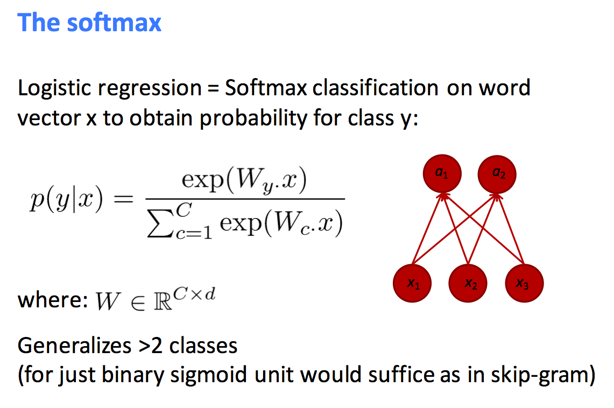
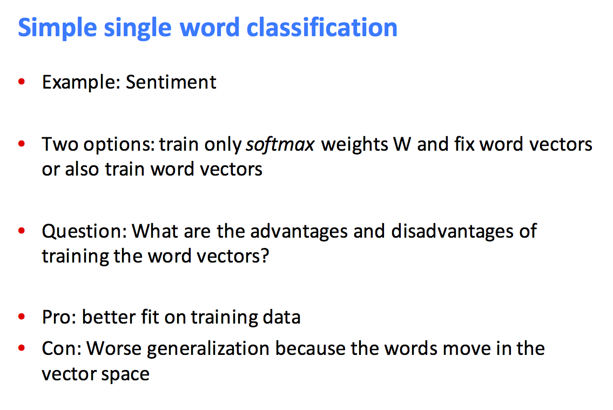

# learn-SentimentAnalysis

Five classes of sentiment level, which are represented by 0 to 4 in the code, respectively:
“very negative (−−)”, “negative (−)”, “neutral”, “positive (+)”, “very positive (++)”

## 1. Train a softmax classifier with the word vectors

* 可以只使用出现频率较高的word(比如top10)，需要训练的是word vector前面的系数，以及截距（在softmax classifier中使用线性函数）。这种方法保留了一些word vector的信息，但丢掉了词频的信息，也丢掉了词汇排列的信息。

* 可以把所用到的word vector都连成一个列向量，这样看上去就只有一个feature，处理起来相对简单。

* 如果word vector用的是固定的值，就只有系数W(:)需要拟合，总的维度是Cd，C是类别的个数，d是feature（word vector）的个数，这与一般的机器学习的数据拟合是类似的。如果word vector也需要拟合，需要拟合的变量的总的维度就是Cd+Vd（总维度极高，很容易过拟合），C是类别的个数，V是word vector的维度，d是word vector的个数。If you only have a small training data set, don’t train the word vectors. If you have have a very large dataset, it may work beZer to train word vectors to the task.

* A simple way of representing a sentence is taking the average of the vectors of the words in the sentence. 然后训练这个word vector前面的系数，以及截距（在softmax classifier中使用线性函数）。Averaging word vectors destroys word vectors and word order, and doesn’t handle negation.

* To avoid overfitting to the training examples and generalizing poorly to unseen examples, introduce regularization when doing classification (in fact, most machine learning tasks). Regularization目标是使每个系数都很小，从而使得预测的函数曲线很平滑，提高test的准确度。在拟合过程中，常出现的问题就是过拟合，也就是参数的增加等使得training error不断减小，但到了一定程度，test error反而不断增加，这意味着出现了过拟合，模型的预测能力相当有限。

* These word vectors work better: higher dimensional word vectors may encode more information, vectors that were trained on a much larger corpus

* 测试结果可以用confusion matrix的heatmap来展示

对于此处的sentiment analysis，C个类别，d个feature（比如d个word vector）。W.x是线性函数的矩阵形式。

对于某些预测word的自然语言处理，C个word，每个word vector的维度是d。

x本质上是一个set（一个集合，哪怕表面是用list表示的），x的各个元素并没有严格的先后顺序，也就不能抓住相应的信息。比如对于图像识别，x是一组像素点，如果使用basic neural network来做识别，x中并没有包含这些像素点的排列信息。

## 2. K nearest neighbor by EMD of word vectors

类似[topic-classifier](https://github.com/mediaProduct2017/topic-classifier)

这种方法保留了一些word vector和词频的信息，但还是丢掉了词汇排列的信息。

word vector可以认为是用deep learning的办法得到的，整体上用的是其他的machine learning方法。

## 3. Simple single word classification

## 4. window classification, sentence classification and text classification

Simple single word classification在实际中很少使用，实用的最简单的情况是[word window classification](https://github.com/mediaProduct2017/learn-WordWindow)

对于word window classification，除了一般的machine learning，deep learning非常有效，因为window中的词汇个数非常有限，所以计算量不大，非常适合deep learning发挥作用。deep learning不仅能抓住哪些词汇经常一起出现的信息，某些deep learning还能抓住经常一起出现的词汇哪个在前哪个在后的信息。

对于sentence classification，deep learning也比较有效，虽然计算量大，但因为句子中词汇少，所以有实用价值。
某些deep learning不仅能抓住词汇的信息，而且能抓住词汇的排列信息。

* Recurrent Neural Networks
    * Advanced recurrent LSTMs and GRUs
* Convolutional Neural Networks
* Tree Recursive Neural Networks 
* Dynamic Neural Networks

对于text classification，因为词汇量太大，用deep learning虽然能抓住词汇的排列信息（理论上，CNN、RecurrentNN、TreeRNN都是可用的，但计算量太大，失去了实用价值），但计算量大到失去实用价值。如果选取合适的词汇（比如根据词频，或者根据词汇出现的位置-每段开头选几个），词汇量可以减小，但是，这样的话，文本中词汇的排列信息就被打乱了，deep learning擅长抓取文本中词汇排列顺序的优势就没法发挥，只能使用basic neural nets，或者softmax classifier，或者K nearest neighbor等方法。

## 5. Concrete applications

2001年谷歌实现个性化新闻推荐，虽然技术成熟，但这家科学家推动的公司并没有在商业应用上发力。

继2014年7月美联社引进“机器人同事”后，全世界的新闻编辑室纷纷引入自动生成新闻技术。这也是今日头条兴起的时间。

2015年9月，腾讯财经的机器人dreamwriter正式出道；同年11月新华社推出“快笔小新”，主打财经新闻；2016年，第一财经发布智能写稿机器人“DT写稿王”。

* 论文（英文论文）和会议（英文会议）推荐

* 资讯（中文资讯）和会议（中文会议）推荐

* 固定类型科技简报的自动信息抓取与简报撰写（从科技论文中自动抓取信息）：比如生物标志物的从研究到应用的历史报告撰写，并根据此报告建立生物标志物数据库

* 科技论文盘点：提前设好格式和导语，自动抓取科技论文信息（爬虫获取数据技术为主），用机器学习算法判断文章是否在某一主题类别的盘点范围下（自动分类技术为主）。本质上和某种类型文章的自动采编无区别，好处是，通过程序自动写作，可以将其他文章融和起来，避免裸抄的尴尬。有相对固定的新闻模板，较为程序化，题材重复性高（模板式写作，直接往框架里添加内容）。这类文章大多不需要大量采访。

* 财经领域，大量数据：比如科技公司财经信息

* 体育领域，大量数据：比如篮球领域，各种球员数据

* 自动媒体运营：根据各业务板块的需求定制发稿模板、数据自动抓取和稿件生成、各业务部门建稿编审签发。新华社机器人发稿系统后台有500到600个模板，可以根据不同的要求，呈现不同的稿件。目前新华社机器人发稿系统运营维护仅需4到5人，平均一天稿件签发量在100条左右。自动化新闻在可信度和速度方面胜过人类新闻，但在可读性方面要差一些（部分是模板制定者的问题，需要既懂程序又懂写作的人）。

* 人机协作。机器人对数据非常敏感，可以对基础的数据类希望进行分析和写作，并进行可视化，节省记者的时间，降低媒体的成本，提高媒体的效率和收益。需要与人打交道的深度报道，主力是记者，在操作的过程中机器人会帮助记者解决掉很多问题，比如语音转录、数据报表分析、制作成本等等。
